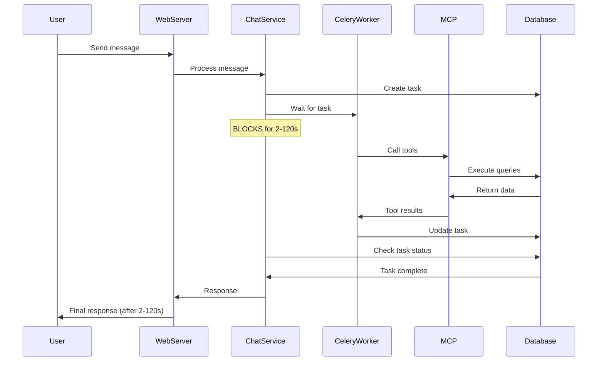
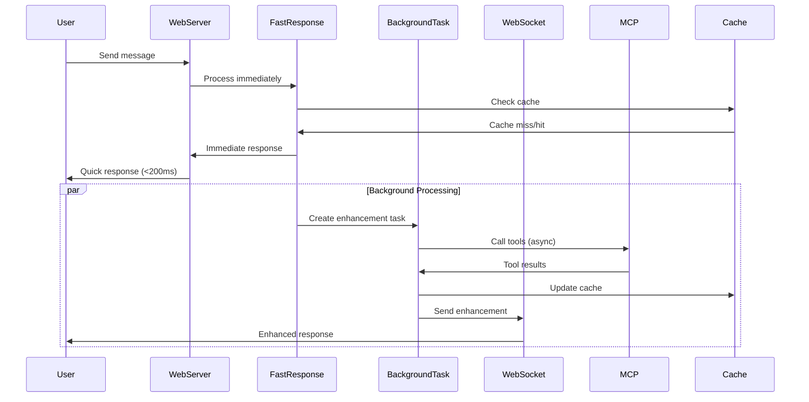
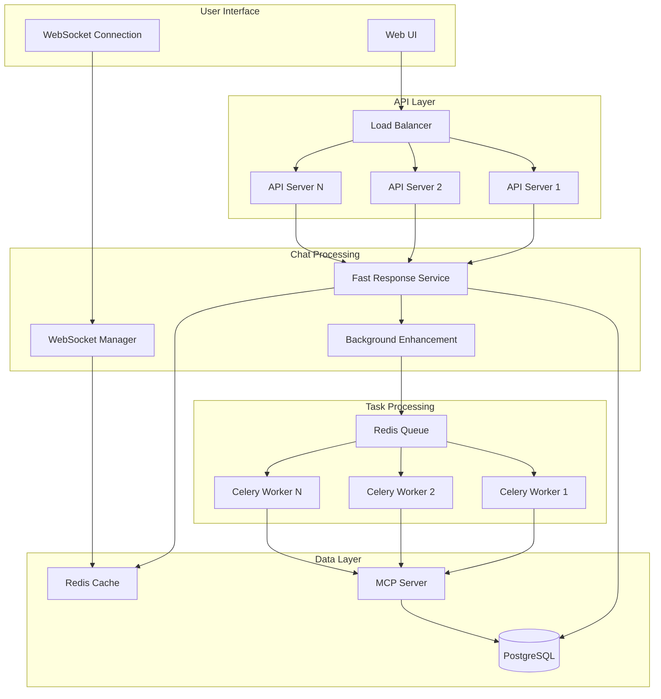

name: "Agent Chat Architecture Optimizations - Performance, Scalability & Reliability"
description: |
  Comprehensive optimization of the agent chat system to address critical performance, scalability, 
  reliability, and security concerns. Transforms blocking synchronous chat processing into a 
  high-performance async system with immediate responses and background tool enhancement.

---

## Purpose

Optimize the current agent chat architecture to address critical issues discovered during implementation:
- **Performance**: Eliminate 2-120 second response delays that break user experience
- **Scalability**: Remove thread-blocking operations limiting concurrent users 
- **Reliability**: Implement graceful degradation and fault tolerance
- **Security**: Add proper authentication, rate limiting, and input validation
- **User Experience**: Provide immediate feedback with progressive enhancement

## Why

**Critical Issues in Current Implementation:**

**Performance Problems:**
- **Blocking web threads**: Chat messages block HTTP workers for up to 120 seconds
- **Synchronous waiting**: Polling task status creates unnecessary latency
- **Poor perceived performance**: Users see no feedback during tool execution
- **Resource waste**: Web servers tied up with long-running operations
- **Database pressure**: Constant polling creates unnecessary DB load

**Scalability Limitations:**
- **Connection exhaustion**: Limited concurrent users due to thread blocking
- **Memory accumulation**: Polling operations consume growing memory
- **Single-threaded bottleneck**: Each chat blocks entire request thread
- **No horizontal scaling**: Architecture doesn't support multiple instances

**Reliability Concerns:**
- **Single point of failure**: If Celery worker dies, all chats fail
- **No graceful degradation**: All-or-nothing tool access
- **Lost context**: Failed tasks lose conversation context
- **Race conditions**: Multiple rapid messages create competing tasks
- **No retry mechanism**: Failed operations aren't automatically retried

**Security Gaps:**
- **No input validation**: Chat messages processed without sanitization
- **Missing rate limiting**: No protection against chat spam/DoS
- **Insufficient logging**: Limited audit trail for security analysis
- **Token exposure**: JWT tokens potentially logged in task data

**Business Impact:**
- **Poor user retention**: 2+ second delays drive users away
- **Limited concurrent capacity**: Can't handle production load
- **Operational fragility**: System fails under normal usage patterns
- **Support overhead**: Users frustrated by unresponsive interface

## What

Transform the current blocking chat architecture into a high-performance, scalable system:

### Core Architecture Changes
1. **Immediate Response Pattern**: Always respond to users within 200ms
2. **Background Tool Enhancement**: Run tool operations asynchronously
3. **Progressive Disclosure**: Enhance responses with tool data when available
4. **Graceful Degradation**: Provide value even when tools are unavailable
5. **WebSocket Follow-up**: Real-time delivery of enhanced responses

### Performance Optimizations
- **Non-blocking operations**: No HTTP threads wait for background tasks
- **Response streaming**: Progressive content delivery for long operations
- **Intelligent caching**: Cache agent configurations and frequent tool results
- **Connection pooling**: Reuse database and HTTP connections efficiently
- **Resource optimization**: Minimize memory usage and CPU overhead

### Scalability Improvements  
- **Horizontal scaling**: Support multiple service instances
- **Queue-based processing**: Distribute tool operations across workers
- **Load balancing**: Smart routing of chat requests
- **Resource isolation**: Separate chat handling from tool execution
- **Auto-scaling support**: Dynamic resource allocation based on load

### Reliability Enhancements
- **Circuit breakers**: Prevent cascade failures in tool systems
- **Retry mechanisms**: Automatic recovery from transient failures  
- **Health monitoring**: Proactive detection of system issues
- **Fallback responses**: Meaningful responses when tools fail
- **State persistence**: Maintain chat context through failures

### Security Hardening
- **Input sanitization**: Comprehensive validation of all user inputs
- **Rate limiting**: Per-user and per-IP request throttling
- **Audit logging**: Complete security event tracking
- **Token security**: Secure handling and rotation of authentication tokens
- **Access control**: Fine-grained permissions for tool access

## All Needed Context

### Performance Requirements
```yaml
response_times:
  initial_response: <200ms  # Immediate user feedback
  tool_enhancement: <30s    # Background processing
  streaming_chunks: <100ms  # Real-time updates
  error_recovery: <5s       # Fallback activation

throughput:
  concurrent_chats: 1000+   # Production load capacity
  messages_per_second: 100+ # Peak message handling
  tool_calls_per_minute: 500+ # Background processing capacity

resource_limits:
  memory_per_chat: <10MB    # Memory efficiency
  cpu_per_message: <100ms   # Processing efficiency  
  database_connections: <50  # Connection efficiency
```

### Architecture Patterns
```yaml
patterns:
  immediate_response: "Fast non-tool response first"
  progressive_enhancement: "Background tool data added later"
  graceful_degradation: "Partial responses better than errors"
  circuit_breaking: "Fail fast on unhealthy dependencies"
  async_processing: "Never block user-facing threads"
  stateless_handlers: "Support horizontal scaling"
```

### Technology Stack
```yaml
core_technologies:
  web_framework: "FastAPI with async/await"
  task_queue: "Celery with Redis broker"
  real_time: "WebSocket connections"
  caching: "Redis for hot data"
  monitoring: "Prometheus + Grafana"
  
performance_tools:
  response_caching: "Redis with TTL"
  connection_pooling: "SQLAlchemy async pools"
  load_balancing: "Nginx upstream"
  monitoring: "APM with OpenTelemetry"
```

## Step-by-Step Implementation Plan

### Phase 1: Immediate Response Architecture (Priority 1)

**Step 1.1: Create Fast Response Service**
- [ ] Implement `FastResponseService` for sub-200ms responses
- [ ] Create lightweight agent without MCP tools for speed
- [ ] Add response caching for common queries
- [ ] Implement graceful fallbacks for agent failures

**Step 1.2: Async Task Enhancement**
- [ ] Create `BackgroundEnhancementService` for tool operations
- [ ] Implement task creation without blocking web threads
- [ ] Add intelligent detection of tool-requiring messages
- [ ] Create follow-up message delivery system

**Step 1.3: WebSocket Integration**
- [ ] Implement WebSocket connections for real-time updates
- [ ] Create message routing for enhanced responses
- [ ] Add connection management and heartbeat monitoring
- [ ] Implement authentication for WebSocket connections

### Phase 2: Performance Optimizations (Priority 1)

**Step 2.1: Response Caching**
- [ ] Implement Redis-based response caching
- [ ] Add cache invalidation strategies
- [ ] Create cache warming for popular queries
- [ ] Add cache performance monitoring

**Step 2.2: Connection Optimization**
- [ ] Implement async database connection pooling
- [ ] Optimize HTTP client connections for MCP
- [ ] Add connection health monitoring
- [ ] Implement connection retry logic

**Step 2.3: Resource Management**
- [ ] Add memory usage monitoring and limits
- [ ] Implement CPU usage tracking
- [ ] Add automatic resource cleanup
- [ ] Create resource usage alerting

### Phase 3: Scalability Improvements (Priority 1)

**Step 3.1: Stateless Architecture**
- [ ] Remove in-memory state from chat handlers
- [ ] Implement session state in Redis
- [ ] Add load balancer compatibility
- [ ] Create horizontal scaling tests

**Step 3.2: Queue Optimization**
- [ ] Implement priority queues for different task types
- [ ] Add queue monitoring and alerting
- [ ] Create automatic queue scaling
- [ ] Implement queue health checks

**Step 3.3: Auto-scaling Support**
- [ ] Add service health endpoints
- [ ] Implement graceful shutdown
- [ ] Create scaling metrics and triggers
- [ ] Add container readiness probes

### Phase 4: Reliability Enhancements (Priority 2)

**Step 4.1: Circuit Breaker Pattern**
- [ ] Implement circuit breakers for MCP connections
- [ ] Add circuit breaker for database operations
- [ ] Create circuit breaker monitoring
- [ ] Add automatic recovery mechanisms

**Step 4.2: Retry and Fallback**
- [ ] Implement exponential backoff retry logic
- [ ] Add retry limits and circuit breaking
- [ ] Create fallback response templates
- [ ] Implement partial response handling

**Step 4.3: Health Monitoring**
- [ ] Add comprehensive health checks
- [ ] Implement dependency health monitoring
- [ ] Create automated alerting
- [ ] Add performance regression detection

### Phase 5: Security Hardening (Priority 2)

**Step 5.1: Input Validation**
- [ ] Implement comprehensive input sanitization
- [ ] Add message length and rate limits
- [ ] Create content filtering for malicious inputs
- [ ] Add input validation logging

**Step 5.2: Authentication Security**
- [ ] Implement secure JWT handling
- [ ] Add token rotation and expiry
- [ ] Create secure token storage
- [ ] Implement session security

**Step 5.3: Audit and Monitoring**
- [ ] Add comprehensive audit logging
- [ ] Implement security event monitoring
- [ ] Create suspicious activity detection
- [ ] Add compliance reporting

### Phase 6: Advanced Features (Priority 3)

**Step 6.1: Intelligent Caching**
- [ ] Implement semantic caching for similar queries
- [ ] Add personalized response caching
- [ ] Create cache preloading strategies
- [ ] Implement cache analytics

**Step 6.2: Advanced Monitoring**
- [ ] Add real-time performance dashboards
- [ ] Implement predictive scaling
- [ ] Create performance optimization recommendations
- [ ] Add user experience metrics

## Architecture Diagrams

### Current Architecture (Problematic)


### Optimized Architecture (Proposed)


### System Architecture Overview


## Success Criteria

### Performance Metrics
- [ ] **Initial response time**: < 200ms for 95% of requests
- [ ] **Tool enhancement delivery**: < 30s for 95% of requests
- [ ] **Concurrent user capacity**: Support 1000+ simultaneous chats
- [ ] **Message throughput**: Handle 100+ messages/second
- [ ] **Memory efficiency**: < 10MB per active chat session
- [ ] **CPU efficiency**: < 100ms processing per message

### Reliability Metrics
- [ ] **Uptime**: 99.9% availability during business hours
- [ ] **Error rate**: < 0.1% of chat messages result in errors
- [ ] **Recovery time**: < 5s to fallback when tools unavailable
- [ ] **Data consistency**: Zero lost messages or chat context
- [ ] **Graceful degradation**: Useful responses even when tools fail

### Scalability Metrics
- [ ] **Horizontal scaling**: Linear performance with additional instances
- [ ] **Resource utilization**: < 70% CPU/memory under normal load
- [ ] **Auto-scaling**: Automatic scaling based on demand
- [ ] **Load distribution**: Even distribution across service instances

### Security Metrics
- [ ] **Input validation**: 100% of inputs validated and sanitized
- [ ] **Rate limiting**: Protection against abuse and DoS
- [ ] **Audit coverage**: Complete logging of security events
- [ ] **Authentication**: Secure token handling and rotation
- [ ] **Access control**: Proper authorization for all operations

## Validation Strategy

### Load Testing
```bash
# Performance validation commands
# Test concurrent chat sessions
artillery run tests/load/chat-performance.yml

# Test message throughput
artillery run tests/load/message-throughput.yml

# Test tool enhancement latency  
artillery run tests/load/tool-performance.yml

# Test WebSocket connections
artillery run tests/load/websocket-performance.yml
```

### Reliability Testing
```bash
# Chaos engineering tests
# Test Celery worker failures
docker stop celery-worker-1
./tests/reliability/worker-failure-test.sh

# Test database connection failures
./tests/reliability/db-failure-test.sh

# Test MCP server failures
./tests/reliability/mcp-failure-test.sh

# Test high load scenarios
./tests/reliability/high-load-test.sh
```

### Security Testing
```bash
# Security validation
# Test input sanitization
./tests/security/input-validation-test.sh

# Test rate limiting
./tests/security/rate-limit-test.sh

# Test authentication
./tests/security/auth-security-test.sh

# Test audit logging
./tests/security/audit-test.sh
```

## Risk Mitigation

### Technical Risks
- **WebSocket connection management**: Implement connection pooling and heartbeat
- **Cache coherency**: Use Redis pub/sub for cache invalidation
- **Memory leaks**: Add comprehensive resource monitoring and cleanup
- **Race conditions**: Implement proper async synchronization

### Operational Risks
- **Deployment complexity**: Implement blue-green deployment strategy
- **Monitoring gaps**: Add comprehensive observability from day one
- **Performance regression**: Implement automated performance testing
- **Security vulnerabilities**: Regular security audits and penetration testing

### Business Risks
- **User experience disruption**: Implement feature flags for gradual rollout
- **Data loss**: Comprehensive backup and recovery procedures
- **Service interruption**: Implement graceful degradation and rollback plans
- **Compliance issues**: Ensure audit trails and data protection measures

## Implementation Timeline

**Phase 1 (Week 1-2)**: Immediate Response Architecture
- Critical path: Eliminate blocking operations
- Risk: High - Core architecture changes

**Phase 2 (Week 2-3)**: Performance Optimizations
- Critical path: Caching and connection pooling
- Risk: Medium - Performance tuning

**Phase 3 (Week 3-4)**: Scalability Improvements
- Critical path: Stateless architecture
- Risk: Medium - Deployment complexity

**Phase 4 (Week 4-5)**: Reliability Enhancements
- Critical path: Circuit breakers and monitoring
- Risk: Low - Additive improvements

**Phase 5 (Week 5-6)**: Security Hardening
- Critical path: Input validation and audit logging
- Risk: Low - Security layer additions

**Phase 6 (Week 6+)**: Advanced Features
- Critical path: Intelligent caching and monitoring
- Risk: Low - Optional enhancements

## Estimated Resource Requirements

**Development**: 4-6 weeks full-time senior engineer
**DevOps**: 2 weeks for deployment and monitoring setup
**Testing**: 1 week for comprehensive testing and validation
**Documentation**: 1 week for operational procedures and runbooks

**Infrastructure Changes**:
- Redis instance for caching and WebSocket state
- Load balancer for horizontal scaling
- Monitoring and alerting stack
- Additional Celery workers for tool processing

This comprehensive optimization addresses all identified performance, scalability, reliability, and security concerns while maintaining backward compatibility and providing a superior user experience.