# AI Infrastructure Architecture Diagrams

## AI Service Analysis

The `ai_service.py` file serves as the **LEGACY AI service layer** and is now **REDUNDANT** after the refactoring. Here's why:

### **Current State (REDUNDANT):**
- **ai_service.py:** Old service using stateless agents (`customer_support_agent`, `categorization_agent`)
- **Functionality:** Basic ticket creation with AI, file analysis, categorization
- **Issues:** No MCP integration, stateless agents, no organization scoping

### **New Architecture (REFACTORED):**
- **ai_agent_service.py:** Organization-scoped agent management with persistence
- **CustomerSupportAgent (refactored):** Full MCP integration with tool calling
- **ai_chat_service.py:** Uses organization-scoped agents with configuration management

**🔄 RECOMMENDATION:** The `ai_service.py` should be deprecated and replaced with the new agent architecture.

---

## 1. AI Service Lifecycle Diagram


## 2. AI Infrastructure Components Diagram

```mermaid
graph TB
    subgraph "External Layer"
        EXT1[Chrome Extension]
        EXT2[API Clients]
        EXT3[Third-party Integrations]
    end
    
    subgraph "API Layer"
        API1[FastAPI Application]
        API2[/api/v1/agents/* - Agent Management]
        API3[/api/v1/chat/* - Chat Endpoints]  
        API4[/api/v1/tickets/* - Ticket Management]
    end
    
    subgraph "Service Layer"
        SRV1[ai_agent_service.py<br/>Organization-scoped agent management]
        SRV2[ai_chat_service.py<br/>Chat processing with agents]
        SRV3[ai_config_service.py<br/>Configuration management]
        SRV4[ai_service.py<br/>🚫 LEGACY - Now redundant]
    end
    
    subgraph "Agent Layer"
        AGENT1[CustomerSupportAgent<br/>Refactored with MCP integration]
        AGENT2[customer_support_agent.py<br/>🚫 OLD - Stateless agent]
        AGENT3[categorization_agent.py<br/>Still used for categorization]
        AGENT4[title_generation_agent.py<br/>Chat title generation]
    end
    
    subgraph "MCP Integration"
        MCP1[MCP Client<br/>Pydantic AI integration]
        MCP2[MCP Server<br/>13 tools available]
        MCP3[Tool Categories:<br/>• 10 Ticket Management<br/>• 2 Integration Discovery<br/>• 1 System Health]
    end
    
    subgraph "Configuration"
        CFG1[ai_config.yaml<br/>Agent defaults & prompts]
        CFG2[Environment Variables<br/>API keys & settings]
    end
    
    subgraph "Data Layer"
        DB1[AIAgent Model<br/>Persistent agent configuration]
        DB2[AgentUsageStats<br/>Performance tracking]
        DB3[Organization<br/>Multi-tenancy]
        DB4[ChatConversation<br/>Conversation persistence]
    end
    
    subgraph "AI Providers"
        AI1[OpenAI GPT Models]
        AI2[Google Gemini Models]
    end
    
    %% External to API
    EXT1 --> API3
    EXT2 --> API1
    EXT3 --> API4
    
    %% API to Services
    API2 --> SRV1
    API3 --> SRV2
    API4 --> SRV1
    
    %% Services to Agents
    SRV1 --> AGENT1
    SRV2 --> AGENT1
    SRV3 --> CFG1
    SRV4 -.-> AGENT2
    
    %% Agent to MCP
    AGENT1 --> MCP1
    MCP1 --> MCP2
    
    %% Configuration
    CFG1 --> SRV1
    CFG1 --> SRV2
    CFG2 --> AI1
    CFG2 --> AI2
    
    %% Data Layer
    SRV1 --> DB1
    SRV1 --> DB2
    SRV2 --> DB4
    DB1 --> DB3
    
    %% AI Providers
    AGENT1 --> AI1
    AGENT1 --> AI2
    AGENT2 --> AI1
    AGENT3 --> AI1
    AGENT4 --> AI1
    
    %% Styling
    classDef legacy fill:#ffcdd2,stroke:#d32f2f,stroke-width:2px,stroke-dasharray: 5 5
    classDef new fill:#c8e6c9,stroke:#388e3c,stroke-width:2px
    classDef mcp fill:#e1f5fe,stroke:#0288d1,stroke-width:2px
    classDef config fill:#fff3e0,stroke:#f57c00,stroke-width:2px
    
    class SRV4,AGENT2 legacy
    class SRV1,AGENT1,API2 new
    class MCP1,MCP2,MCP3 mcp
    class CFG1,CFG2 config
```

## 3. Current AI Architecture vs Legacy

### **NEW ARCHITECTURE (Post-Refactoring):**

```mermaid
sequenceDiagram
    participant User
    participant API as FastAPI
    participant AAS as ai_agent_service
    participant Agent as CustomerSupportAgent (Refactored)
    participant MCP as MCP Server
    participant AI as AI Provider
    participant DB as Database

    User->>API: POST /api/v1/chat/conversations/{id}/messages
    API->>AAS: ensure_organization_agent(org_id)
    AAS->>DB: Query AIAgent for organization
    
    alt Agent Missing
        AAS->>DB: Create AIAgent with ai_config.yaml defaults
        AAS->>Agent: Initialize with persistent config
    else Agent Exists
        AAS->>Agent: Load existing configuration
    end
    
    Agent->>MCP: Initialize with toolsets=[mcp_server]
    MCP-->>Agent: 13 tools available
    
    API->>Agent: process_message(message, context)
    Agent->>AI: PydanticAI with MCP toolset
    AI->>MCP: Call tools (e.g., get_active_integrations)
    MCP-->>AI: Tool results
    AI-->>Agent: Response with tools_used
    Agent-->>API: ChatResponse
    API-->>User: Response with actual tool results
    
    Note over User,DB: ✅ Tools used: ['get_active_integrations']<br/>✅ Organization gets actual integration data
```



### **LEGACY ARCHITECTURE (Pre-Refactoring):**


## 4. Component Responsibilities

### **ACTIVE COMPONENTS (Post-Refactoring):**

| Component | Responsibility | Status |
|-----------|---------------|--------|
| `ai_agent_service.py` | **Organization-scoped agent CRUD, auto-provisioning, lifecycle management** | ✅ NEW |
| `CustomerSupportAgent (refactored)` | **Persistent agents with MCP integration, tool calling, org scoping** | ✅ NEW |
| `ai_chat_service.py` | **Chat processing using organization agents, config-driven creation** | ✅ UPDATED |
| `ai_config_service.py` | **Configuration loading from ai_config.yaml, prompt templates** | ✅ UPDATED |
| `/api/v1/agents/*` | **Agent management endpoints for orgs** | ✅ NEW |
| `ai_config.yaml` | **13-tool config, MCP enabled, comprehensive prompts** | ✅ UPDATED |
| `AIAgent` + `AgentUsageStats` models | **Persistent agent configuration and statistics** | ✅ NEW |

### **LEGACY COMPONENTS (Redundant):**

| Component | Old Responsibility | Status |
|-----------|-------------------|--------|
| `ai_service.py` | Legacy AI operations with stateless agents | 🚫 **REDUNDANT** |
| `customer_support_agent.py` | Old stateless agent without MCP integration | 🚫 **REDUNDANT** |
| `categorization_agent.py` | Still used by legacy ai_service.py | ⚠️ **DEPRECATED** |

### **MCP INTEGRATION FLOW:**

```
ai_config.yaml (13 tools) 
    ↓
ai_agent_service.load_default_agent_configuration()
    ↓  
CustomerSupportAgent.initialize()
    ↓
PydanticAI Agent(toolsets=[mcp_server])
    ↓
MCP Server (13 tools: ticket management + integrations + health)
    ↓
Backend API (actual tool calls)
    ↓
Real data returned to user
```

## 5. Migration Path Forward

### **IMMEDIATE CLEANUP NEEDED:**

1. **Remove Legacy Files:**
   - `app/services/ai_service.py` (redundant)
   - `app/agents/customer_support_agent.py` (replaced)

2. **Update Imports:**
   - Replace `ai_service` imports with `ai_agent_service`
   - Replace old `customer_support_agent` with refactored version

3. **Update Endpoints:**
   - Migrate any endpoints using `ai_service` to use organization-scoped agents
   - Update ticket creation to use new agent architecture

### **ARCHITECTURE BENEFITS:**

✅ **Organization Isolation:** Each org has independent agent configuration  
✅ **Tool Integration:** Agents actually call MCP tools instead of providing guidance  
✅ **Configuration Management:** Centralized defaults with org-specific overrides  
✅ **Auto-Provisioning:** Zero-setup experience for new organizations  
✅ **Performance Tracking:** Usage statistics and health monitoring per agent  
✅ **API Management:** Complete agent lifecycle via REST API  

### **SUCCESS METRICS ACHIEVED:**

- **MCP Tools Working:** ✅ Agents use `toolsets=[mcp_server]` 
- **Configuration Driven:** ✅ All defaults from `ai_config.yaml`
- **Organization Scoped:** ✅ One agent per organization with isolation
- **API Complete:** ✅ Full agent management endpoints
- **Database Schema:** ✅ Persistent agent configuration and stats

The refactoring successfully transformed the system from stateless, tool-disabled agents to a robust, organization-scoped agent management platform with full MCP integration.