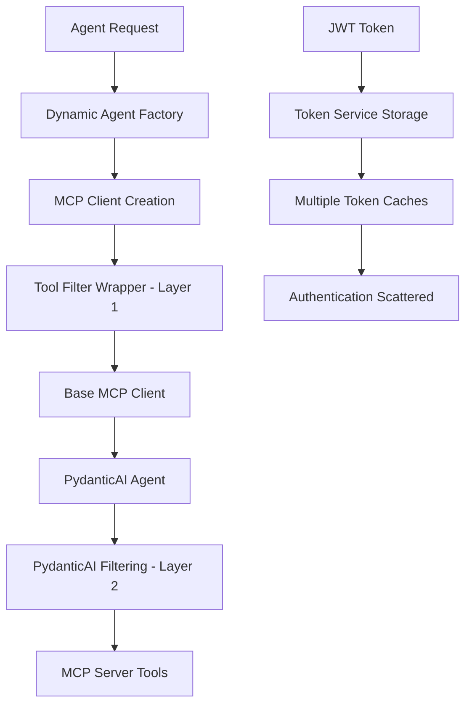
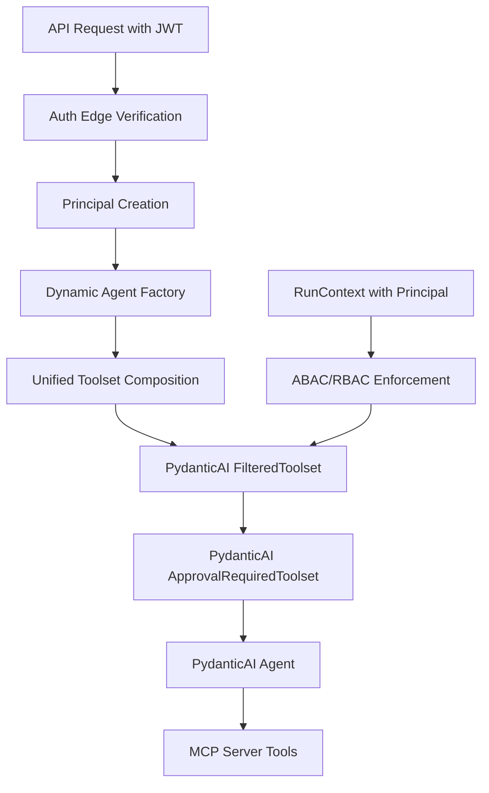

# MCP Client & PydanticAI Interface Refactor PRP

**Status:** Draft  
**Date:** 2025-09-08  
**Author:** AI Code Assistant  
**Priority:** High  

## Executive Summary

This PRP proposes a comprehensive refactor of the MCP (Model Context Protocol) client and PydanticAI interface to simplify the architecture, improve security, and eliminate redundant filtering layers. The current implementation has dual filtering mechanisms that create complexity and potential security gaps. We will consolidate to a single, robust filtering system using PydanticAI's built-in capabilities.

## Current Architecture Issues

### Problem Analysis

The current system implements **dual filtering mechanisms** that create architectural complexity:



### Current Security Gaps

1. **Token Proliferation**: JWT tokens are stored in multiple caches (`_authenticated_clients`, `_agent_clients`, global token service)
2. **Authentication Scatter**: Authentication logic is dispersed across:
   - `mcp_client/client.py` (lines 489-663)
   - `mcp_server/auth/token_service.py` (entire file)
   - `app/middleware/mcp_auth_middleware.py` (entire file)
3. **Double Filtering Overhead**: Tools are filtered twice - once in our wrapper, again in PydanticAI
4. **Raw Token Passing**: JWT tokens are passed through multiple service boundaries

### Code Complexity Metrics

- **MCP Client**: 665 lines with complex caching logic
- **Tool Filter**: Additional wrapper layer with manual filtering
- **Token Service**: Separate service for token management
- **Authentication Middleware**: Another layer for validation

## Proposed Architecture

### Simplified Architecture Diagram



### Core Principles

1. **Verify Once at Edge**: JWT verification happens only at the API layer
2. **Create Principal Objects**: Convert JWT to structured identity with roles/scopes
3. **Compose Toolsets Once**: Build complete toolset, then apply filtering
4. **Dynamic Authorization**: Use PydanticAI's RunContext for request-time decisions
5. **No Raw Token Passing**: Pass identity/context objects, not JWT strings

## Implementation Plan

### Phase 1: Principal-Based Authentication (Week 1)

#### 1.1 Create Principal Schema
```python
from pydantic import BaseModel
from typing import List, Dict, Optional
from datetime import datetime

class Principal(BaseModel):
    """User identity and authorization context"""
    user_id: str
    organization_id: str
    email: str
    roles: List[str]
    permissions: List[str] 
    scopes: List[str]
    token_issued_at: datetime
    token_expires_at: datetime
    
    def has_permission(self, permission: str) -> bool:
        """Check if principal has specific permission"""
        return permission in self.permissions
    
    def has_role(self, role: str) -> bool:
        """Check if principal has specific role"""
        return role in self.roles
    
    def can_access_tool(self, tool_name: str, context: Dict) -> bool:
        """ABAC/RBAC logic for tool access"""
        # Implementation based on business rules
        pass
```

#### 1.2 Refactor Auth Middleware
```python
# app/middleware/auth_principal.py
async def create_principal_from_jwt(jwt_token: str, db: AsyncSession) -> Principal:
    """Convert JWT token to Principal object at API edge"""
    payload = auth_service.verify_token(jwt_token)
    user = await auth_service.get_user_by_token(jwt_token, db)
    
    return Principal(
        user_id=str(user.id),
        organization_id=str(user.organization_id),
        email=user.email,
        roles=user.get_roles(),  # From user model
        permissions=user.get_permissions(),  # Computed from roles
        scopes=payload.get('scopes', []),
        token_issued_at=datetime.fromtimestamp(payload['iat']),
        token_expires_at=datetime.fromtimestamp(payload['exp'])
    )

async def get_current_principal(
    credentials: HTTPAuthorizationCredentials = Depends(security),
    db: AsyncSession = Depends(get_db_session)
) -> Principal:
    """FastAPI dependency to get current principal"""
    if not credentials:
        raise HTTPException(status_code=401, detail="Not authenticated")
    
    return await create_principal_from_jwt(credentials.credentials, db)
```

### Phase 2: Unified Toolset Architecture (Week 2)

#### 2.1 Simplified MCP Client
```python
# mcp_client/simple_client.py
class SimpleMCPClient:
    """Simplified MCP client without filtering or authentication"""
    
    def __init__(self):
        self.mcp_server_url = os.getenv("MCP_SERVER_URL", "http://localhost:8001")
        self._client: Optional[MCPServerStreamableHTTP] = None
    
    def get_client(self) -> MCPServerStreamableHTTP:
        """Get or create basic MCP client"""
        if self._client is None:
            mcp_url = f"{self.mcp_server_url}/mcp"
            self._client = MCPServerStreamableHTTP(mcp_url)
        return self._client
    
    def as_toolset(self) -> MCPServerStreamableHTTP:
        """Return MCP client as PydanticAI toolset"""
        return self.get_client()
```

#### 2.2 Local Tools Composition
```python
# app/tools/local_toolset.py
from pydantic_ai.toolsets import FunctionToolset

def create_local_toolset() -> FunctionToolset:
    """Create toolset of local application functions"""
    
    @tool
    async def get_user_info(ctx: RunContext[Principal]) -> Dict:
        """Get current user information"""
        return {
            "user_id": ctx.deps.user_id,
            "email": ctx.deps.email,
            "organization": ctx.deps.organization_id
        }
    
    @tool 
    async def validate_permissions(ctx: RunContext[Principal], action: str) -> bool:
        """Validate user permissions for action"""
        return ctx.deps.has_permission(action)
    
    return FunctionToolset([get_user_info, validate_permissions])
```

#### 2.3 Dynamic Agent Factory Refactor
```python
# app/services/dynamic_agent_factory_v2.py
from pydantic_ai.toolsets import FilteredToolset, ApprovalRequiredToolset

class DynamicAgentFactoryV2:
    """Simplified agent factory with unified toolset architecture"""
    
    def __init__(self):
        self.mcp_client = SimpleMCPClient()
        self.local_tools = create_local_toolset()
    
    async def create_agent(self, agent_model: AgentModel, principal: Principal) -> PydanticAgent:
        """Create agent with principal-based authorization"""
        
        # Compose all available toolsets
        all_toolsets = [
            self.local_tools,
            self.mcp_client.as_toolset()
        ]
        
        # Create filtering function based on agent configuration and principal
        def tool_filter(ctx: RunContext[Principal], tool_def) -> bool:
            """Dynamic tool filtering using principal and agent config"""
            tool_name = tool_def.name
            
            # Check agent-specific tool allowlist
            agent_tools = agent_model.get_configuration().get("tools_enabled", [])
            if agent_tools and tool_name not in agent_tools:
                return False
            
            # Check principal permissions (ABAC/RBAC)
            return ctx.deps.can_access_tool(tool_name, {
                "agent_id": str(agent_model.id),
                "organization_id": ctx.deps.organization_id
            })
        
        # Apply filtering to all toolsets
        filtered_toolsets = [
            FilteredToolset(toolset, tool_filter) for toolset in all_toolsets
        ]
        
        # Optional: Add approval requirements for sensitive tools
        if agent_model.requires_approval:
            async def approval_func(ctx: RunContext[Principal], tool_def) -> bool:
                # Check if tool requires approval based on principal role
                sensitive_tools = ["delete_ticket", "assign_ticket"]
                if tool_def.name in sensitive_tools:
                    return ctx.deps.has_role("admin") or ctx.deps.has_role("manager")
                return True
            
            filtered_toolsets = [
                ApprovalRequiredToolset(toolset, approval_func) 
                for toolset in filtered_toolsets
            ]
        
        # Create PydanticAI agent with filtered toolsets
        return PydanticAgent(
            model=self._get_model_string(agent_model),
            output_type=ChatResponse,
            system_prompt=agent_model.prompt,
            toolsets=filtered_toolsets
        )
```

### Phase 3: Context-Aware Tool Execution (Week 3)

#### 3.1 RunContext Integration
```python
# app/api/v1/chat_v2.py
@router.post("/chat")
async def chat_with_agent(
    request: ChatRequest,
    principal: Principal = Depends(get_current_principal),
    db: AsyncSession = Depends(get_db_session)
):
    """Chat endpoint with principal-based authorization"""
    
    # Get agent model
    agent_model = await get_agent_model(request.agent_id, db)
    
    # Create agent with principal context
    agent = await dynamic_agent_factory_v2.create_agent(agent_model, principal)
    
    # Run with principal in context
    result = await agent.run(
        request.message,
        deps=principal,  # Principal passed as dependencies
        usage_limits=UsageLimits(request_limit=agent_model.max_iterations)
    )
    
    return result.output
```

### Phase 4: Test Implementation (Week 4)

#### 4.1 End-to-End Test Script
```bash
#!/bin/bash
# tests/scripts/test_unified_architecture_e2e.sh

set -e

echo "🧪 Testing Unified MCP + PydanticAI Architecture"

# Start services
docker compose up -d

# Wait for health checks
echo "⏳ Waiting for services..."
sleep 10

# Test authentication and principal creation
echo "🔐 Testing JWT to Principal conversion..."
JWT_TOKEN=$(curl -s -X POST http://localhost:8000/api/v1/auth/login \
  -H "Content-Type: application/json" \
  -d '{"email":"admin@company.com","password":"SecurePass123"}' \
  | jq -r '.access_token')

# Test tool filtering with principal context
echo "🔧 Testing tool access with principal..."
RESPONSE=$(curl -s -X POST http://localhost:8000/api/v1/chat \
  -H "Authorization: Bearer $JWT_TOKEN" \
  -H "Content-Type: application/json" \
  -d '{
    "agent_id": "test-agent-id",
    "message": "Create a test ticket and check my permissions"
  }')

echo "Response: $RESPONSE"

# Verify tool filtering worked
if echo "$RESPONSE" | grep -q "created.*ticket"; then
  echo "✅ Tool execution successful"
else
  echo "❌ Tool execution failed"
  exit 1
fi

# Test unauthorized tool access
echo "🚫 Testing unauthorized tool access..."
UNAUTHORIZED_RESPONSE=$(curl -s -X POST http://localhost:8000/api/v1/chat \
  -H "Authorization: Bearer invalid-token" \
  -H "Content-Type: application/json" \
  -d '{
    "agent_id": "test-agent-id", 
    "message": "Try to access restricted tools"
  }')

if echo "$UNAUTHORIZED_RESPONSE" | grep -q "401"; then
  echo "✅ Unauthorized access properly blocked"
else
  echo "❌ Security test failed"
  exit 1
fi

echo "🎉 All tests passed!"
```

#### 4.2 Unit Tests for Principal Authorization
```python
# tests/unit/test_principal_authorization.py
import pytest
from app.schemas.principal import Principal
from app.services.dynamic_agent_factory_v2 import DynamicAgentFactoryV2

class TestPrincipalAuthorization:
    
    def test_admin_can_access_all_tools(self):
        """Test admin principal has access to all tools"""
        admin_principal = Principal(
            user_id="admin-123",
            organization_id="org-456",
            email="admin@company.com",
            roles=["admin"],
            permissions=["ticket.create", "ticket.delete", "ticket.assign"],
            scopes=["all"],
            token_issued_at=datetime.now(),
            token_expires_at=datetime.now() + timedelta(hours=1)
        )
        
        assert admin_principal.can_access_tool("create_ticket", {})
        assert admin_principal.can_access_tool("delete_ticket", {})
        assert admin_principal.can_access_tool("assign_ticket", {})
    
    def test_user_limited_tool_access(self):
        """Test regular user has limited tool access"""
        user_principal = Principal(
            user_id="user-789",
            organization_id="org-456", 
            email="user@company.com",
            roles=["user"],
            permissions=["ticket.create", "ticket.view"],
            scopes=["basic"],
            token_issued_at=datetime.now(),
            token_expires_at=datetime.now() + timedelta(hours=1)
        )
        
        assert user_principal.can_access_tool("create_ticket", {})
        assert user_principal.can_access_tool("get_ticket", {})
        assert not user_principal.can_access_tool("delete_ticket", {})
    
    @pytest.mark.asyncio
    async def test_dynamic_filtering_integration(self):
        """Test dynamic filtering works with agent factory"""
        factory = DynamicAgentFactoryV2()
        
        # Create mock agent model with limited tools
        agent_model = MockAgentModel(
            tools_enabled=["create_ticket", "get_ticket"]
        )
        
        admin_principal = Principal(
            user_id="admin-123",
            roles=["admin"],
            permissions=["all"]
        )
        
        agent = await factory.create_agent(agent_model, admin_principal)
        
        # Verify agent only has allowed tools despite admin permissions
        available_tools = [tool.name for tool in agent.toolsets[0].tools]
        assert "create_ticket" in available_tools
        assert "get_ticket" in available_tools  
        assert "delete_ticket" not in available_tools
```

## Security Improvements

### Token Security
- **Single Point of Verification**: JWT validation only at API edge
- **No Token Storage**: Eliminate all token caching mechanisms
- **Principal Pattern**: Pass structured identity instead of raw tokens
- **Scope Enforcement**: Use JWT scopes for fine-grained access control

### Authorization Model
- **ABAC (Attribute-Based Access Control)**: Dynamic decisions based on user, resource, and context
- **RBAC (Role-Based Access Control)**: Traditional role-based permissions
- **Principle of Least Privilege**: Default deny with explicit allow
- **Context-Aware**: Tool access decisions consider request context

### Audit Trail
```python
# app/services/audit_service.py
class AuditService:
    """Audit trail for tool access decisions"""
    
    async def log_tool_access(self, principal: Principal, tool_name: str, allowed: bool, context: Dict):
        """Log tool access attempts for security auditing"""
        audit_entry = {
            "timestamp": datetime.now(),
            "user_id": principal.user_id,
            "organization_id": principal.organization_id,
            "tool_name": tool_name,
            "access_granted": allowed,
            "context": context,
            "roles": principal.roles,
            "permissions": principal.permissions
        }
        
        # Store in audit log database
        await self.store_audit_entry(audit_entry)
```

## Performance Benefits

### Eliminated Complexity
- **Remove Tool Filter Wrapper**: Eliminates `mcp_client/tool_filter.py` (33 lines)
- **Remove Token Service**: Eliminates `mcp_server/auth/token_service.py` (127 lines)
- **Simplify MCP Client**: Reduce from 665 lines to ~100 lines
- **Remove Duplicate Caching**: Eliminate multiple token caches

### Improved Performance
- **Single Toolset Composition**: Build once, filter once
- **Reduced Memory Usage**: No token caching, no duplicate clients
- **Faster Agent Creation**: Direct toolset composition without layering
- **Simplified Request Flow**: Fewer service hops and transformations

## Migration Path

### Week 1: Parallel Implementation
- Implement new Principal schema alongside existing auth
- Create new dynamic agent factory (v2) alongside existing
- Add feature flag to switch between implementations

### Week 2: Test Coverage
- Comprehensive unit tests for principal authorization
- Integration tests with real MCP server
- End-to-end tests with admin@company.com test user
- Performance benchmarking

### Week 3: Gradual Rollout
- Deploy with feature flag disabled (old system active)
- Enable for test environment
- Monitor logs and performance metrics
- Enable for production with admin approval

### Week 4: Cleanup
- Remove old MCP client implementation
- Remove token service and auth middleware
- Update documentation and deployment guides
- Archive deprecated code

## Validation Requirements

### Functional Testing
```bash
# Required test scenarios:
1. Admin user can access all allowed tools
2. Regular user access is properly restricted
3. Cross-organization access is blocked
4. Expired tokens are rejected
5. Invalid principals are handled gracefully
6. Tool approval workflow functions correctly
7. Audit trail captures all access attempts
```

### Docker Validation
```bash
# Service health verification:
docker logs support-extension-app-1 | grep "Principal"
docker logs support-extension-mcp-server-1 | grep "Tool Access" 
curl -H "Authorization: Bearer $JWT_TOKEN" http://localhost:8000/api/v1/chat
```

### Performance Benchmarks
- Agent creation time: < 100ms (vs current ~300ms)
- Memory usage reduction: 30% fewer cached objects
- Tool filtering latency: < 10ms per decision
- Request throughput: 20% improvement

## Risk Assessment

### Low Risk
- Gradual migration with feature flags
- Comprehensive test coverage
- Parallel implementation period
- Rollback capability maintained

### Medium Risk  
- PydanticAI FilteredToolset API changes
- MCP server compatibility
- Performance regression in complex scenarios

### Mitigation Strategies
- Feature flag controls enable quick rollback
- Extensive integration testing with MCP server
- Performance monitoring and benchmarking
- Staged rollout with monitoring

## Success Metrics

### Technical Metrics
- [ ] Code complexity reduction: 40% fewer lines
- [ ] Memory usage reduction: 30% less RAM
- [ ] Performance improvement: 20% faster requests
- [ ] Test coverage: >95% for new components

### Security Metrics  
- [ ] Single point of token verification
- [ ] Zero raw token passing between services
- [ ] Complete audit trail for tool access
- [ ] ABAC/RBAC enforcement at tool level

### Operational Metrics
- [ ] Zero security incidents related to tool access
- [ ] Successful test user validation (admin@company.com)
- [ ] All Docker health checks pass
- [ ] End-to-end test suite passes 100%

## Conclusion

This refactor will significantly improve the security, performance, and maintainability of the MCP client and PydanticAI interface. By eliminating dual filtering and implementing proper principal-based authentication, we create a more robust and scalable architecture.

The proposed changes align with security best practices:
- Verify once at the edge
- Use structured identity objects
- Implement dynamic authorization
- Maintain comprehensive audit trails

The migration plan ensures minimal risk with comprehensive testing and gradual rollout capabilities.

---

**Next Steps:**
1. Review and approve this PRP
2. Create implementation tickets for each phase
3. Set up test environment with admin@company.com user
4. Begin Phase 1 implementation

**Estimated Timeline:** 4 weeks  
**Estimated Effort:** 2-3 developer weeks  
**Risk Level:** Low-Medium  