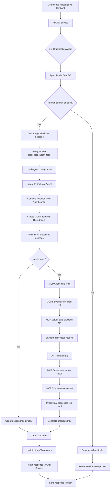

# MCP Agent Integration Flow - System Diagram & Workflow

## Overview
This document outlines the complete flow from user message to agent response using the existing Agent task architecture with MCP tool integration. The goal is to remove the hardcoded `customer_support_agent.py` and make MCP tools work with any Agent model that has `mcp_enabled=True`.

## Current State vs Target State

### Current State (Hardcoded CustomerSupportAgent)
```
User Message → AI Chat Service → CustomerSupportAgent (hardcoded) → MCP Client → MCP Server → Tools → API
```

### Target State (Dynamic Agent with Task System)
```
User Message → AI Chat Service → Agent Model → AgentTask (Celery) → MCP Client (with agent config) → MCP Server → Tools → API → Task Result → Agent Response
```

## System Architecture Diagram



## Detailed Workflow

### Phase 1: Message Reception & Agent Discovery
1. **User sends message** via Chat API endpoint
2. **AI Chat Service** receives message with thread context
3. **Get Organization Agent**:
   - Look up Agent model for organization
   - Auto-create customer support agent if none exists
   - Load Agent configuration from database

### Phase 2: Task Creation & Dispatch
4. **Check MCP enablement**:
   - If `agent.mcp_enabled = True` → Create AgentTask
   - If `agent.mcp_enabled = False` → Process directly without tools
5. **Create AgentTask**:
   ```python
   task = await agent_task_service.create_task(
       agent_id=agent.id,
       task_type="chat_message",
       task_data={
           "message": user_message,
           "thread_id": thread_id,
           "user_id": user_id,
           "organization_id": organization_id
       },
       priority=3  # High priority for chat
   )
   ```
6. **Celery Worker** picks up task via `process_agent_task(task_id)`

### Phase 3: Agent Initialization & Tool Setup
7. **Load Agent Configuration**:
   ```python
   agent = await agent_service.get_agent(task.agent_id)
   config = agent.get_configuration()
   tools_enabled = config.get("tools_enabled", [])
   ```
8. **Create Pydantic AI Agent**:
   - Use agent's prompt, model, and settings
   - Get system prompt from agent.prompt field
   - Set model from agent configuration
9. **Initialize MCP Client with Agent Tools**:
   ```python
   mcp_client = mcp_client.create_filtered_client(
       enabled_tools=tools_enabled,
       agent_id=agent.id,
       organization_id=agent.organization_id
   )
   ```

### Phase 4: Message Processing with Tool Access
10. **Pydantic AI processes message**:
    ```python
    result = await pydantic_agent.run(
        user_input=message,
        toolsets=[mcp_client] if tools_enabled else []
    )
    ```
11. **Tool calling flow** (if needed):
    - Pydantic AI determines tools are needed
    - Calls specific tools via MCP Client
    - MCP Client filters calls based on agent's `tools_enabled`
    - MCP Server receives tool call request

### Phase 5: MCP Tool Execution
12. **MCP Server processes tool call**:
    - Validates tool is enabled for this agent
    - Calls appropriate backend API endpoint
    - Examples:
      - `create_ticket` → `POST /api/v1/tickets`
      - `search_tickets` → `GET /api/v1/tickets?query=...`
      - `get_system_health` → `GET /health`
13. **Backend API processes request**:
    - Authenticates using agent's organization context
    - Processes the actual business logic
    - Returns structured data
14. **MCP Server returns tool result** to MCP Client
15. **MCP Client returns result** to Pydantic AI Agent

### Phase 6: Response Generation & Task Completion
16. **Pydantic AI generates final response**:
    - Incorporates tool results into response
    - Uses agent's tone, communication_style, etc.
17. **Update AgentTask status**:
    ```python
    await agent_task_service.update_task_status(
        task_id,
        "completed",
        result_data={"response": ai_response, "tools_used": tools_called}
    )
    ```
18. **Record AgentAction** for analytics:
    ```python
    await record_agent_action(
        agent_id=agent.id,
        action_type="chat_response", 
        action_data={"message": user_message},
        result_data={"response": ai_response}
    )
    ```

### Phase 7: Response Delivery
19. **AI Chat Service receives task result**
20. **Return response to user** via Chat API
21. **Store message in Thread** for conversation history

## Key Implementation Points

### 1. MCP Client Agent Filtering
The MCP Client needs to be enhanced to filter tool calls based on agent configuration:

```python
class MCPClient:
    def create_agent_client(self, agent_id: UUID, tools_enabled: List[str]) -> MCPServerStreamableHTTP:
        """Create MCP client filtered for specific agent tools"""
        client = MCPServerStreamableHTTP(f"{self.mcp_server_url}/mcp")
        client._enabled_tools = tools_enabled  # Filter available tools
        return client
```

### 2. Agent Configuration Integration
Each Agent model contains the tools it should have access to:

```python
# Agent configuration from database
{
    "tools_enabled": [
        "create_ticket", "search_tickets", "get_ticket", 
        "update_ticket", "get_system_health"
    ],
    "prompt": "You are a customer support agent...",
    "model_provider": "openai",
    "model_name": "gpt-4o-mini"
}
```

### 3. Task-Based Processing
All agent operations go through the AgentTask system:
- **Synchronous**: Simple responses without tools
- **Asynchronous**: Complex responses requiring tool calls
- **Queue management**: Proper priority and retry handling
- **Analytics**: Full tracking of agent performance

### 4. Backward Compatibility
The new system maintains the same external API:
- Chat endpoints remain unchanged
- Response format stays consistent
- Organization isolation preserved
- Authentication flow unchanged

## File Changes Required

### Core Changes
1. **Update `mcp_client/client.py`**:
   - Add agent-specific client creation
   - Add tool filtering based on agent config
   - Add organization context to tool calls

2. **Update `app/services/ai_chat_service.py`**:
   - Remove hardcoded CustomerSupportAgent import
   - Use AgentTask system for tool-enabled agents
   - Create Pydantic AI agents dynamically

3. **Update `app/tasks/agent_tasks.py`**:
   - Add `chat_message` task type
   - Integrate Pydantic AI + MCP Client
   - Handle tool calling flow

### New Components
4. **Create `app/services/dynamic_agent_runner.py`**:
   - Factory for creating Pydantic AI agents from Agent models
   - MCP integration based on agent configuration
   - Tool filtering and validation

5. **Update `app/services/agent_service.py`**:
   - Ensure default customer support agents have proper MCP tools
   - Load configuration from ai_config.yaml for defaults

## Success Criteria

1. **Remove hardcoded dependency**: No references to `customer_support_agent.py`
2. **Dynamic agent creation**: Any Agent model can be used for chat
3. **Tool filtering**: Agents only access their configured tools
4. **Task integration**: All tool-enabled operations go through AgentTask system
5. **Performance**: Response times remain comparable
6. **Analytics**: Full tracking of agent and tool usage
7. **Testing**: All existing tests pass with new architecture

## Testing Strategy

### Unit Tests
- Test dynamic agent creation from Agent models
- Test MCP client filtering based on tools_enabled
- Test task creation for different agent types

### Integration Tests  
- Test complete flow from message to response
- Test tool calling through task system
- Test agent isolation (tools per organization)

### End-to-End Tests
- Test chat with different agent configurations
- Test agents with different tool sets
- Test performance under load

This architecture leverages the existing sophisticated Agent task system while removing the hardcoded customer support agent dependency and making MCP tools work with any agent configuration.