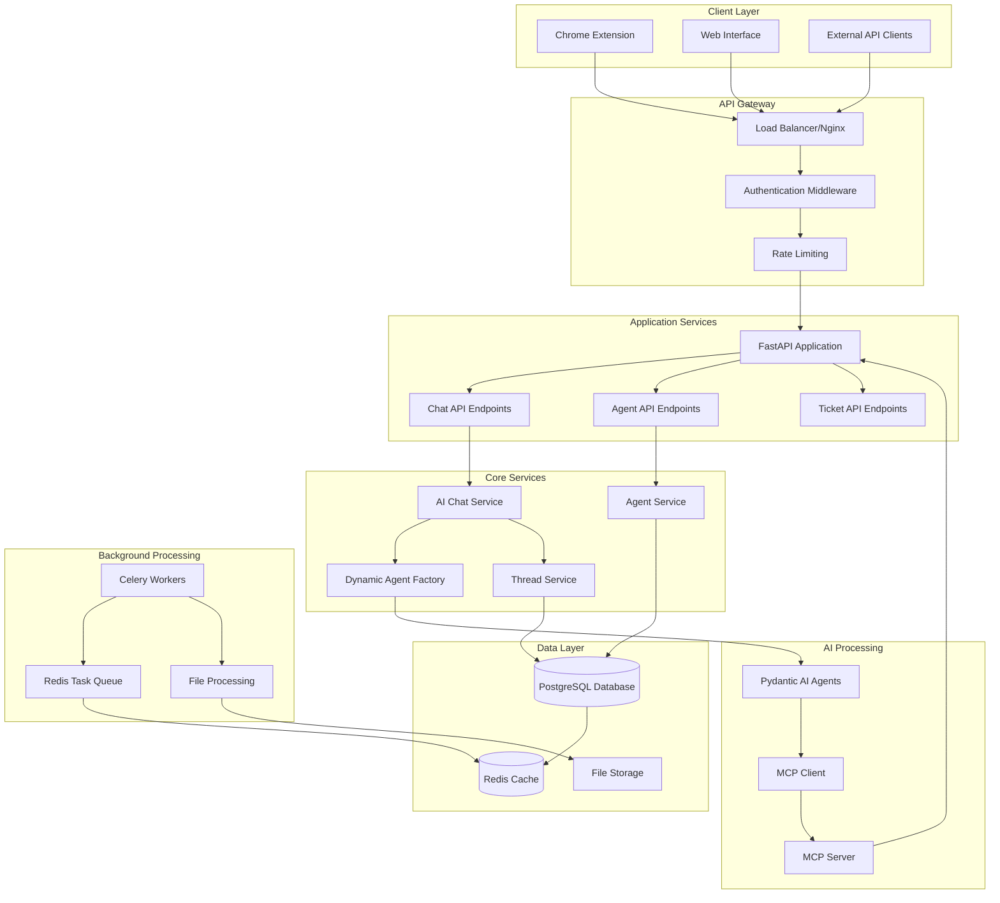
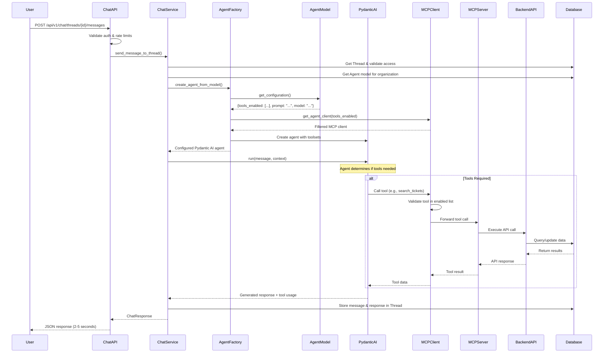
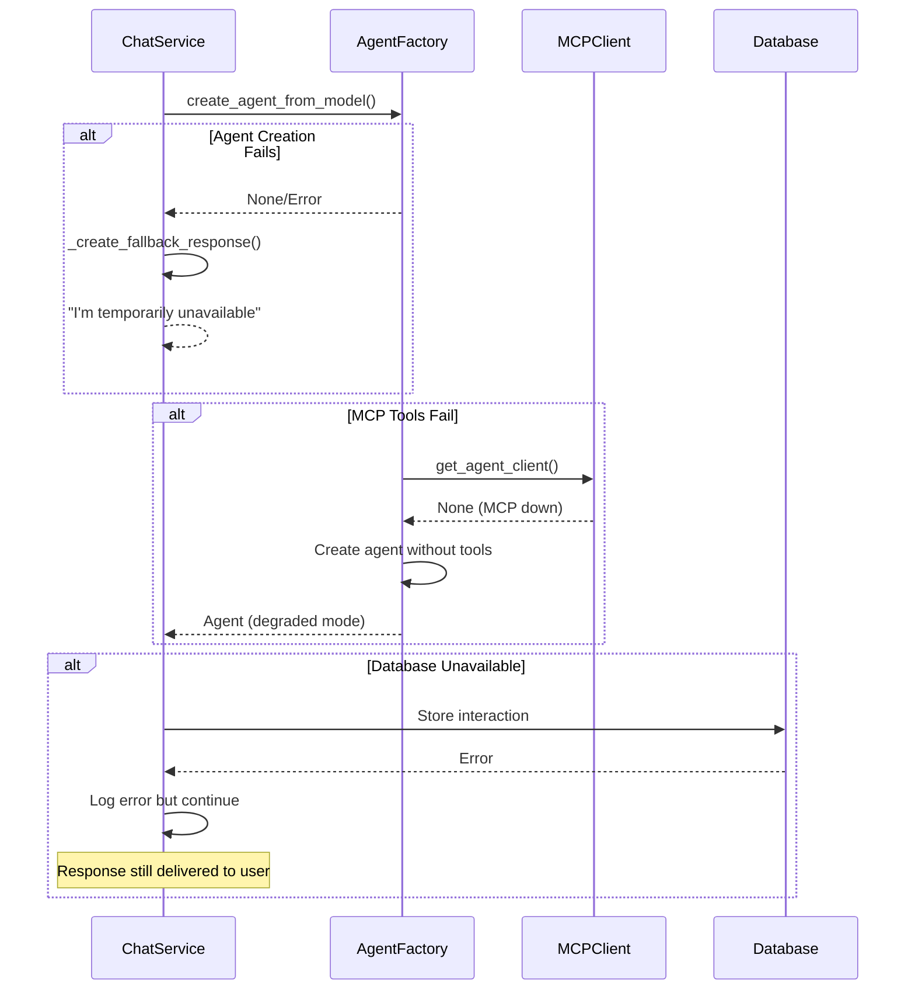
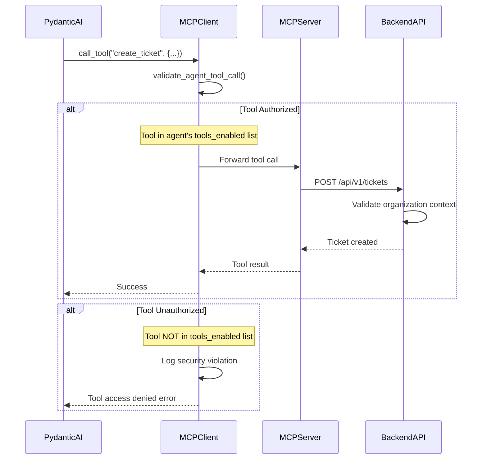
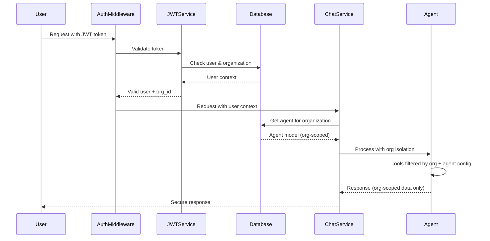
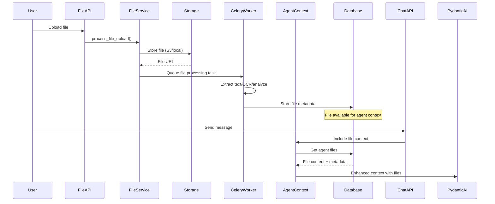
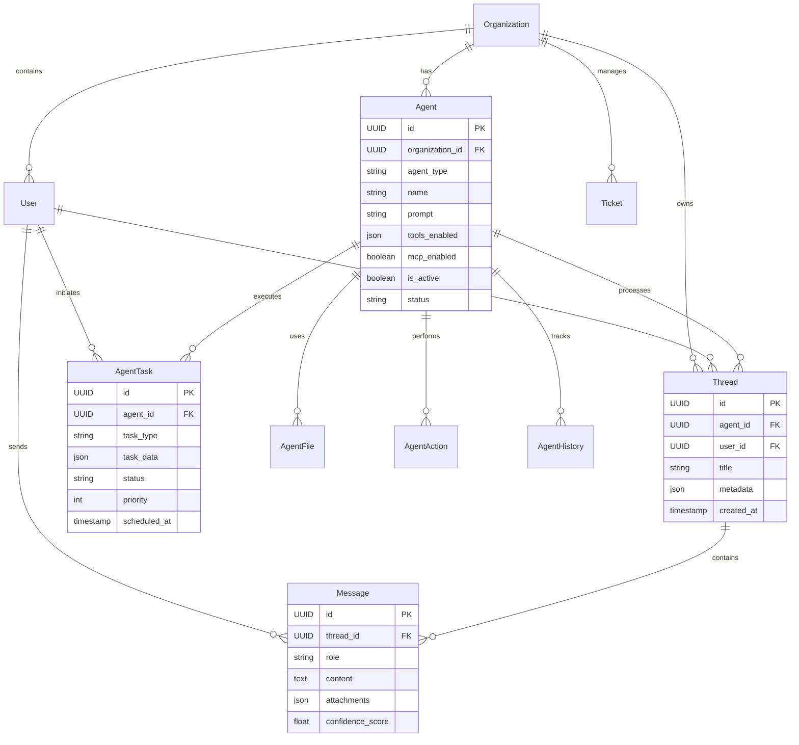
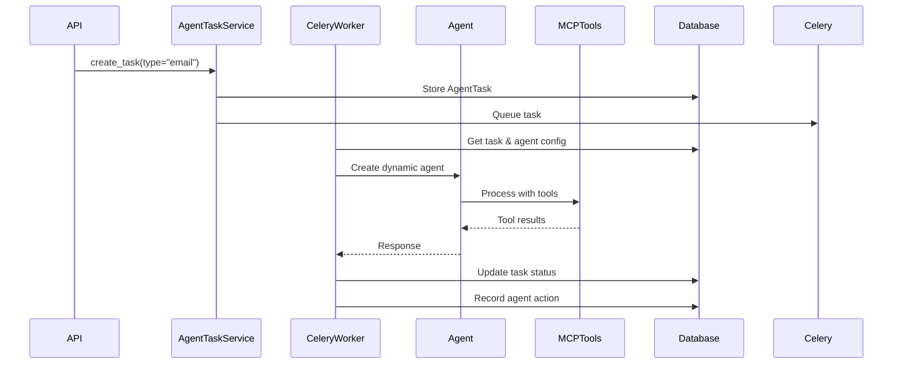
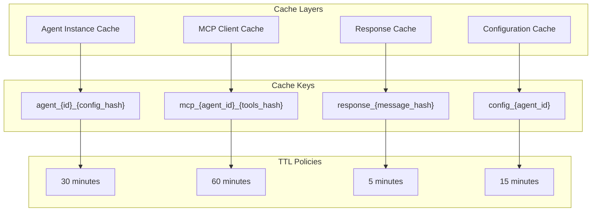

# System Data Flows & Architecture Documentation

This document provides a comprehensive overview of the system's data flows and architecture to validate the correctness of implementation and ensure proper understanding of all system interactions.

## Table of Contents
- [Core Architecture Overview](#core-architecture-overview)
- [Data Flow Patterns](#data-flow-patterns)
- [Component Interactions](#component-interactions)
- [Security & Authentication Flows](#security--authentication-flows)
- [Performance & Scalability Patterns](#performance--scalability-patterns)
- [Validation Checkpoints](#validation-checkpoints)

## Core Architecture Overview

### System Components


## Data Flow Patterns

### 1. Chat Message Processing Flow

#### Standard Chat Message Flow (Primary)


#### Error Handling Flow


### 2. Agent Configuration Flow

#### Agent Creation & Configuration
```mismaid
sequenceDiagram
    participant OrgSetup
    participant AgentService
    participant Database
    participant ConfigService

    OrgSetup->>AgentService: ensure_organization_agent()
    AgentService->>Database: Check existing agent
    
    alt No Agent Exists
        AgentService->>ConfigService: load_default_agent_configuration()
        ConfigService->>ConfigService: Parse ai_config.yaml
        ConfigService-->>AgentService: Default config with tools_enabled
        
        AgentService->>Database: Create Agent with config
        Database-->>AgentService: Agent model
    end
    
    alt Agent Exists
        AgentService->>Database: Get existing Agent
        Database-->>AgentService: Agent model
    end
    
    AgentService-->>OrgSetup: Agent ready
```

#### Agent Configuration Schema
```yaml
# Agent Model Configuration (stored in database)
agent_configuration:
  # Core Identity
  name: "Customer Support Specialist"
  agent_type: "customer_support"
  role: "Customer support agent for technical inquiries"
  prompt: "You are an expert customer support agent..."
  
  # AI Model Configuration
  model_provider: "openai"
  model_name: "gpt-4o-mini" 
  temperature: 0.2
  max_tokens: 2000
  timeout: 30
  
  # MCP Tool Configuration
  mcp_enabled: true
  tools_enabled: [
    "create_ticket",
    "search_tickets", 
    "get_ticket",
    "update_ticket",
    "get_system_health",
    "list_integrations"
  ]
  
  # Behavior Configuration
  tone: "helpful"
  communication_style: "professional"
  use_streaming: true
  response_length: "detailed"
  memory_retention: 10
  max_context_size: 150000
  max_iterations: 8
  timeout_seconds: 120
```

### 3. MCP Tool Execution Flow

#### Tool Call Security & Filtering


#### Available MCP Tools & API Mapping
```yaml
mcp_tools:
  # Ticket Management Tools (10 tools)
  ticket_management:
    - create_ticket: "POST /api/v1/tickets"
    - create_ticket_with_ai: "POST /api/v1/tickets/ai-create"
    - get_ticket: "GET /api/v1/tickets/{ticket_id}"
    - update_ticket: "PUT /api/v1/tickets/{ticket_id}"
    - delete_ticket: "DELETE /api/v1/tickets/{ticket_id}"
    - update_ticket_status: "PATCH /api/v1/tickets/{ticket_id}/status"
    - assign_ticket: "PATCH /api/v1/tickets/{ticket_id}/assign"
    - search_tickets: "GET /api/v1/tickets?query=..."
    - list_tickets: "GET /api/v1/tickets"
    - get_ticket_stats: "GET /api/v1/tickets/stats/overview"
  
  # Integration Tools (2 tools)
  integration_management:
    - list_integrations: "GET /api/v1/integrations"
    - get_active_integrations: "GET /api/v1/integrations/active"
  
  # System Tools (1 tool)
  system_monitoring:
    - get_system_health: "GET /health"
```

### 4. Organization & Security Flow

#### Multi-Tenant Organization Isolation
```mermaid
graph LR
    subgraph "Organization A"
        UserA[User A]
        AgentA[Agent A Config]
        ToolsA[Tools: tickets, health]
        DataA[Organization A Data]
    end
    
    subgraph "Organization B"  
        UserB[User B]
        AgentB[Agent B Config]
        ToolsB[Tools: tickets, integrations]
        DataB[Organization B Data]
    end
    
    subgraph "Shared Infrastructure"
        MCPServer[MCP Server]
        Database[(Database)]
        APIs[Backend APIs]
    end
    
    UserA --> AgentA
    UserB --> AgentB
    
    AgentA --> ToolsA
    AgentB --> ToolsB
    
    ToolsA --> MCPServer
    ToolsB --> MCPServer
    
    MCPServer --> APIs
    APIs --> Database
    
    Database --> DataA
    Database --> DataB
    
    Note over DataA, DataB: Organization-scoped data isolation
```

#### Authentication & Authorization Flow


### 5. File Processing & Context Flow

#### File Upload & Processing


#### Agent File Context Assembly
```yaml
file_context_flow:
  trigger: "Chat message with agent"
  steps:
    1. "Get agent files from database"
    2. "Load processed file content" 
    3. "Assemble into context window"
    4. "Include in agent prompt"
    5. "Agent responds with file knowledge"
  
  file_types:
    - "PDF documents"
    - "Text files" 
    - "CSV data"
    - "XLSX spreadsheets"
    - "Markdown files"
    - "DOCX documents"
  
  processing:
    - "Text extraction"
    - "OCR for images"
    - "Metadata extraction"
    - "Content summarization"
```

### 6. Database Schema & Relationships

#### Core Data Model Relationships


#### Configuration Data Flow
```yaml
agent_configuration_source:
  defaults: "ai_config.yaml"
  storage: "agents table (embedded)"
  override: "organization-specific settings"
  
agent_creation_flow:
  1. "Organization created"
  2. "Load defaults from ai_config.yaml"
  3. "Create Agent with default configuration"
  4. "Store in agents table with tools_enabled"
  5. "Agent ready for chat processing"

configuration_precedence:
  1. "Agent model fields (highest priority)"
  2. "Agent configuration JSON"  
  3. "ai_config.yaml defaults"
  4. "System defaults (fallback)"
```

## Component Interactions

### 1. Chat Processing Components

#### Dynamic Agent Factory
```python
# Core responsibility: Create Pydantic AI agents from Agent models
class DynamicAgentFactory:
    async def create_agent_from_model(agent_model):
        """
        Input: Agent model from database
        Process: 
          - Extract configuration (tools_enabled, prompt, model)
          - Create MCP client with filtered tools
          - Create Pydantic AI agent with toolsets
        Output: Configured Pydantic AI agent
        """
        
    async def process_message_with_agent(agent_model, message, context):
        """
        Input: Agent model + user message + context
        Process:
          - Create agent if not cached
          - Run agent with MCP tools
          - Extract response and tool usage
        Output: ChatResponse with tool usage tracking
        """
```

#### MCP Client Integration
```python
# Core responsibility: Provide filtered tool access per agent
class MCPClient:
    def get_agent_client(agent_id, tools_enabled, organization_id):
        """
        Input: Agent ID + allowed tools list + org context
        Process:
          - Create MCPServerStreamableHTTP client
          - Attach tool filter metadata
          - Cache client for reuse
        Output: Agent-specific MCP client
        """
        
    async def validate_agent_tool_call(agent_client, tool_name):
        """
        Input: Agent client + tool name
        Process: Check if tool in agent's enabled list
        Output: Authorization decision
        """
```

### 2. Background Task Processing

#### Agent Task System (For Non-Chat Operations)


#### Task Types & Processing
```yaml
task_types:
  chat_message: "REMOVED - now processed directly"
  slack_message: "Process Slack messages autonomously"
  email: "Process email requests"
  api_request: "Handle API-initiated requests"
  health_check: "Monitor agent health"
  file_processing: "Process uploaded files"

processing_patterns:
  synchronous: "Chat messages (direct processing)"
  asynchronous: "Slack, email, file processing"
  priority_based: "High priority for user-facing operations"
  retry_logic: "Exponential backoff for failed tasks"
```

### 3. Security & Data Protection

#### Authentication Flow
```yaml
authentication:
  registration: "POST /api/v1/auth/register"
  login: "POST /api/v1/auth/login"
  token_refresh: "POST /api/v1/auth/refresh"
  logout: "POST /api/v1/auth/logout"

jwt_structure:
  claims:
    - user_id: "UUID"
    - organization_id: "UUID" 
    - role: "user|admin"
    - exp: "expiration_timestamp"
    - iat: "issued_at_timestamp"

token_validation:
  middleware: "app.middleware.auth_middleware"
  validation: "JWT signature + expiration"
  organization_context: "Extracted from token"
  rate_limiting: "Per user + IP tracking"
```

#### Data Isolation Patterns
```yaml
organization_isolation:
  agent_access: "Agents only see their organization's data"
  tool_filtering: "MCP tools scoped to organization"
  thread_isolation: "Threads belong to single organization"
  user_segregation: "Users can't access other org data"

security_validations:
  agent_authorization: "Agent belongs to user's organization"
  thread_access: "Thread belongs to user"
  tool_permissions: "Tool in agent's enabled list"
  data_scoping: "All queries include organization_id"
```

## Performance & Scalability Patterns

### 1. Response Time Optimization

#### Performance Targets
```yaml
performance_targets:
  chat_response: "<5 seconds (95th percentile)"
  tool_execution: "<10 seconds per tool"
  file_processing: "<30 seconds background"
  agent_creation: "<1 second (cached)"
  
optimization_strategies:
  agent_caching: "Cache created Pydantic AI agents"
  mcp_connection_pooling: "Reuse MCP client connections"
  database_indexing: "Optimized queries on hot paths"
  response_streaming: "Progressive response delivery"
```

#### Caching Strategy


### 2. Scalability Patterns

#### Horizontal Scaling Support
```yaml
stateless_design:
  session_storage: "Redis for chat context"
  agent_state: "Database-driven (no in-memory state)"
  mcp_connections: "Per-request (no persistent connections)"
  load_balancing: "Round-robin across instances"

resource_management:
  connection_pooling: "SQLAlchemy async pools"
  memory_limits: "Per-agent memory constraints"
  concurrent_limits: "Max agents per instance"
  health_monitoring: "Automatic unhealthy instance removal"
```

## Validation Checkpoints

### 1. Architecture Validation

#### Core Flow Validation
```bash
# Validate agent creation from database
curl -X GET http://localhost:8000/api/v1/agents \
  -H "Authorization: Bearer $TOKEN" \
  | jq '.data[0] | {id, mcp_enabled, tools_enabled}'

# Validate MCP server connectivity  
curl -X GET http://localhost:8001/health

# Validate chat processing
curl -X POST http://localhost:8000/api/v1/chat/threads/{thread_id}/messages \
  -H "Authorization: Bearer $TOKEN" \
  -d '{"content": "Create a test ticket"}' \
  | jq '.response_time_ms'  # Should be <5000ms
```

#### Tool Authorization Validation
```bash
# Test tool filtering by creating agents with different tool sets
# Agent with limited tools should not be able to call unauthorized tools

# Create agent with only search tools
POST /api/v1/agents
{
  "tools_enabled": ["search_tickets", "get_system_health"]
}

# Test that agent cannot create tickets (should fail gracefully)
# Chat: "Create a new ticket for my login issue"
# Expected: Agent explains it cannot create tickets but can search existing ones
```

### 2. Performance Validation

#### Response Time Testing
```bash
# Test response times under load
echo "Testing chat response times..."
for i in {1..10}; do
  start_time=$(date +%s.%N)
  curl -s -X POST http://localhost:8000/api/v1/chat/threads/{thread_id}/messages \
    -H "Authorization: Bearer $TOKEN" \
    -d "{\"content\": \"Help request $i\"}" > /dev/null
  end_time=$(date +%s.%N)
  duration=$(echo "$end_time - $start_time" | bc)
  echo "Request $i: ${duration}s"
done
```

#### Memory & Resource Testing
```bash
# Monitor resource usage during chat operations
docker stats --format "table {{.Name}}\t{{.CPUPerc}}\t{{.MemUsage}}"

# Test concurrent chat sessions
artillery run tests/performance/chat-load-test.yml
```

### 3. Security Validation

#### Organization Isolation Testing
```bash
# Create two organizations with different agents
# Verify agents cannot access each other's data
# Test tool calls respect organization boundaries

# Test 1: User A cannot see User B's tickets
# Test 2: Agent A tools scoped to Organization A data
# Test 3: MCP tools enforce organization context
```

#### Tool Authorization Testing
```bash
# Test tool filtering security
# Agent with limited tools should fail gracefully when requesting unauthorized tools
# Should log security violations without crashing

grep "unauthorized tool" /var/log/mcp_client.log
grep "security violation" /var/log/mcp_client.log  
```

### 4. Integration Validation

#### End-to-End Flow Testing
```bash
# Complete user journey
1. Register user + organization
2. Auto-created agent with default tools
3. Send chat message requiring tools
4. Verify tool calls in MCP logs
5. Verify response includes tool data
6. Verify conversation stored in thread

# Expected results
- Response time: <5 seconds
- Tool calls: Logged in MCP server
- Data isolation: Only organization's data accessed
- Error handling: Graceful degradation if tools fail
```

#### Monitoring & Observability
```yaml
metrics_to_track:
  response_times: "Histogram of chat response latency"
  tool_usage: "Counter of MCP tool calls by agent"
  error_rates: "Percentage of failed responses"
  agent_health: "Status of each agent"
  resource_usage: "Memory/CPU per component"

logging_patterns:
  structured: "JSON format for parsing"
  correlation_ids: "Track requests across services"
  security_events: "Authentication and authorization events"
  performance_events: "Slow queries and operations"
```

## Success Criteria

### ✅ Architecture Validation Checklist

**Core Functionality:**
- [ ] Chat messages process in <5 seconds
- [ ] Agents created dynamically from database config
- [ ] MCP tools filtered per agent configuration
- [ ] No hardcoded agent dependencies remain
- [ ] Organization isolation enforced

**Performance Requirements:**
- [ ] No blocking web server threads
- [ ] Response times consistent under load
- [ ] Memory usage stable over time
- [ ] Database query performance optimized

**Security Requirements:**
- [ ] JWT authentication enforced
- [ ] Organization data isolation verified
- [ ] Tool authorization validated
- [ ] Audit logging comprehensive

**Reliability Requirements:**
- [ ] Graceful degradation when MCP unavailable
- [ ] Error handling doesn't crash services
- [ ] Failed operations logged and recoverable
- [ ] Health monitoring functional

This document serves as the definitive reference for validating that the system architecture and data flows are correctly implemented and performing as expected.